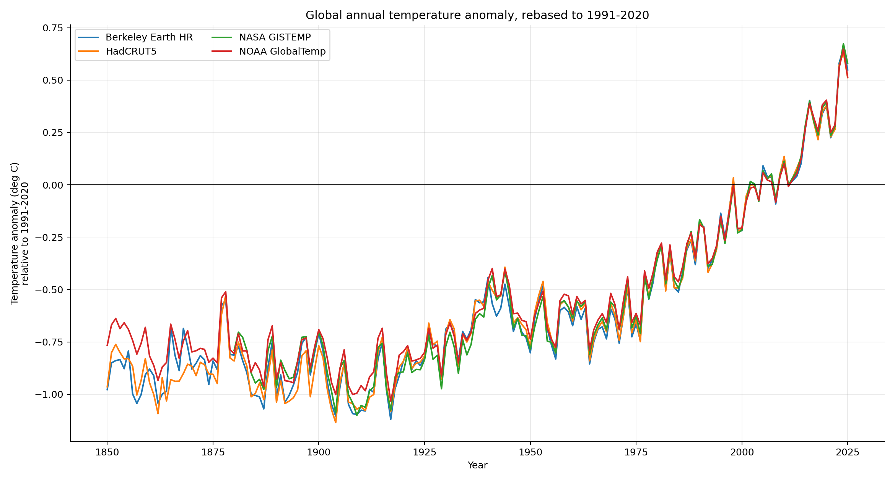
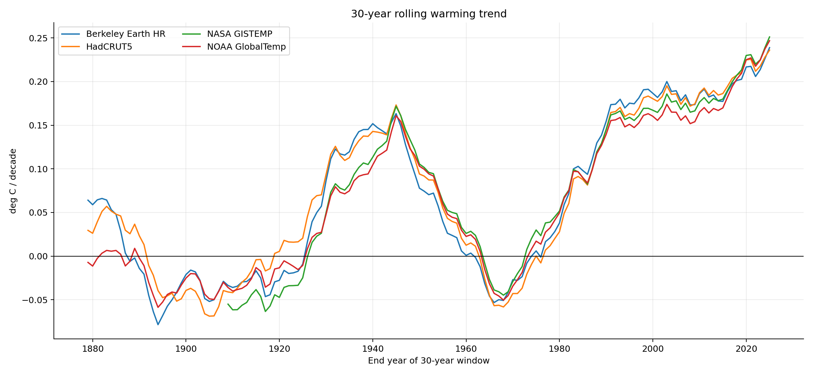
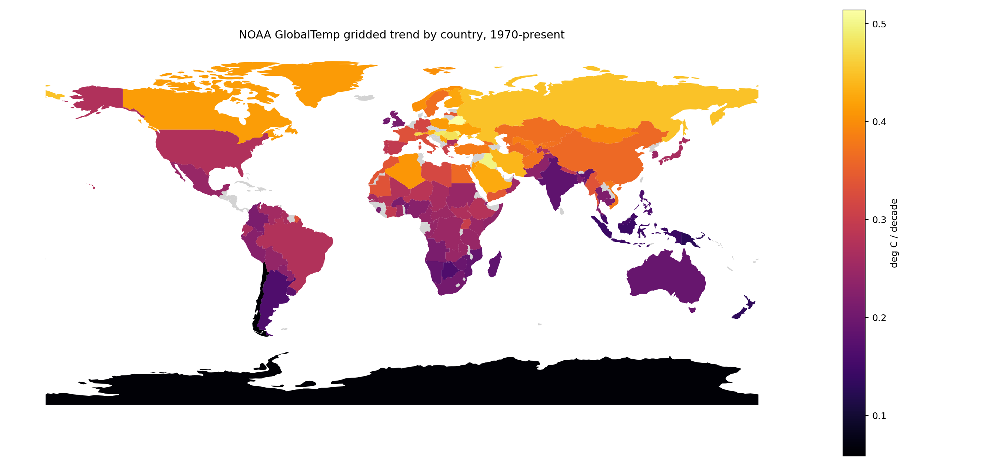
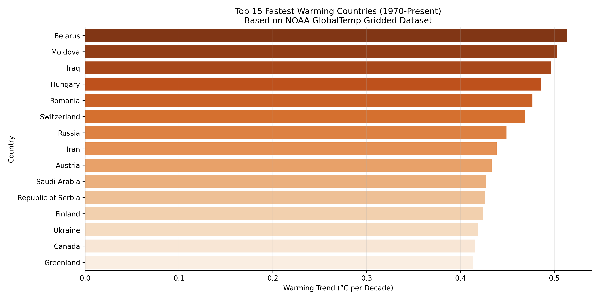
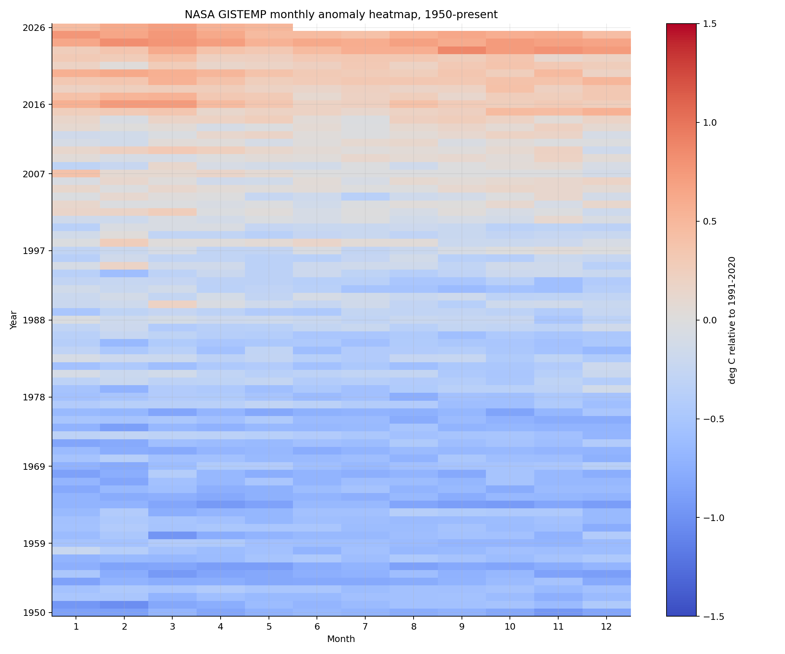

# Global Temperature Trend EDA

Multi-source exploratory data analysis of global surface temperature anomalies, with trend, volatility, uncertainty, and optional regional geospatial analysis.

This project compares four widely used global temperature products:

- NASA GISTEMP v4 global land-ocean temperature index
- NOAA GlobalTemp v6.1 land-ocean global anomaly series
- HadCRUT5 global monthly analysis with uncertainty intervals
- Berkeley Earth high-resolution global monthly land-ocean series

The main notebook is [`global_temperature_analysis.ipynb`](global_temperature_analysis.ipynb).

## Project Goals

1. Verify that the source datasets are reachable and parseable.
2. Standardize the datasets onto a common `1991-2020` anomaly baseline.
3. Compare long-term and recent warming trends across independent products.
4. Explore volatility, rolling trends, month-of-year behavior, distribution shifts, and warm extremes.
5. Extend the analysis spatially using NOAA gridded NetCDF data and GeoPandas.

## Quick Results

Using annual means rebased to `1991-2020`, the estimated global warming trend since 1970 is approximately:

| Dataset | Trend since 1970 |
| --- | ---: |
| Berkeley Earth HR | 0.206 deg C / decade |
| HadCRUT5 | 0.204 deg C / decade |
| NASA GISTEMP | 0.202 deg C / decade |
| NOAA GlobalTemp | 0.195 deg C / decade |

The exact values will update as source datasets are refreshed, but the conclusion is robust: independent global products agree on a strong post-1970 warming trend.

## Key Visualization & Analysis Results

This repository produces several key figures illustrating different aspects of global temperature change. Below is a summary of the core findings:

### 1. Global Annual Temperature Anomaly Comparison
This plot compares the rebased (1991-2020) annual anomaly time series across NASA GISTEMP, NOAA GlobalTemp, HadCRUT5, and Berkeley Earth. It shows strong coherence in global mean trends, highlighting that post-1970 warming is consistently captured by all major data providers.



### 2. Rolling 30-Year Warming Trends
By calculating trends on moving 30-year windows, we observe the acceleration of global warming. The rate of temperature increase has nearly doubled, rising from around 0.1°C/decade in early 30-year periods to approximately 0.2°C/decade in recent decades.



### 3. Regional Warming Trends Map (NOAA GlobalTemp)
Using NOAA's 5°x5° gridded NetCDF dataset, we map the local warming trends (1970-present) onto political boundaries. The map highlights that land masses, particularly in the high-latitude Northern Hemisphere (Arctic and sub-Arctic), are warming much faster than the oceans (a phenomenon known as land-sea warming contrast and polar amplification).



### 4. Top 15 Fastest Warming Countries
A detailed breakdown of warming rates by country, showcasing the nations experiencing the steepest temperature rises since 1970. Northern hemisphere inland countries like Belarus, Moldova, Iraq, and Hungary lead the trend.



### 5. NASA GISTEMP Monthly Anomaly Heatmap
This heatmap illustrates the distribution of monthly temperature anomalies over the years. It clearly displays the shift from blue/neutral anomalies to intense red anomalies in the 21st century, illustrating both the rise in baseline temperatures and the increasing frequency of warm extremes.



## Repository Structure

```text
.
├── check_temperature_datasets.py
├── global_temperature_analysis.ipynb
├── DATASET_CHECK_REPORT.md
├── temperature_dataset_check_results.json
├── temperature_dataset_samples/
├── kaggle_dataset/
├── kaggle_code/
├── requirements.txt
└── README.md
```

## Reproduce the Dataset Check

```bash
python check_temperature_datasets.py
```

This downloads small global mean source files into `temperature_dataset_samples/` and writes `temperature_dataset_check_results.json`.

## Run the Notebook

Install dependencies:

```bash
pip install -r requirements.txt
```

Then open:

```bash
jupyter notebook global_temperature_analysis.ipynb
```

The global EDA runs from the small downloaded source files. The regional GeoPandas section downloads an additional NOAA gridded NetCDF file of about 22 MB on first run and reads it with `netCDF4`.

## Data Sources

- NASA GISTEMP: https://data.giss.nasa.gov/gistemp/data_v4.html
- NOAA GlobalTemp: https://www.ncei.noaa.gov/products/land-based-station/noaa-global-temp
- HadCRUT5: https://www.metoffice.gov.uk/hadobs/hadcrut5/
- Berkeley Earth: https://berkeleyearth.org/data/
- Optional ERA5 comparison: https://cds.climate.copernicus.eu/datasets/reanalysis-era5-single-levels
- Optional JRA-3Q comparison: https://www.data.jma.go.jp/jra/html/JRA-3Q/index_en.html

## Licensing and Attribution

This repository contains scripts, notebooks, and small source-data samples for reproducible analysis. Upstream datasets have their own licenses and citation requirements. Cite the original providers when reusing the data or results.
